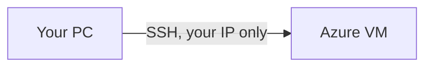

# Project: <name>

**Module:** <number and name>
**Date completed:** YYYY-MM-DD
**Skills:** <e.g. Azure CLI, NSGs, Python>

## Goal
One or two sentences: what this project does and why it matters in real security work.

## Environment
- Azure region / VM sizes / OS
- Tools and versions
- Architecture diagram (screenshot or Mermaid)

## Steps
1. What you did, with the commands (secrets and IPs redacted).
2. ...

## Results
Screenshots, output, metrics. Show before/after where possible.

## Problems I hit and how I solved them
Recruiters love this section. Be honest.

## Security considerations
What would you change before running this in production?

## Cleanup
Commands used to delete resources so nothing keeps billing.

## What I learned
Three bullets, in your own words.
